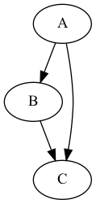
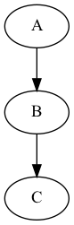

# Assembling sequences

For this assignment, we are going to implement two components of an overlap-layout-consensus assembler.

## Simplify overlap graph by iteratively removing transitively-inferrible edges

For the first part of the assignment, implement the `simplify` function in `remove_transitive_edges.py`. The function takes in an overlap graph, and returns a graph where the transitively-inferrible edges have been removed. For example, it would take a graph 



and return a graph



A `Graph` class is implemented in `graph.py`. You can add any functionality that you need to the class, and/or modify the class as you see fit. Please do not use packages such as `networkx` for this assignment.

Some simple tests to check the expected functionality are implemented in `test_remove_transitive_edges`. You should test your work by running:

```
python3 test_remove_transitive_edges
```

## Implement the shortest common superstring

For the second part of the assignment, implement the  `calculate_scs` function in `shortest_common_superstring.py`. The function takes in a list of sequences and returns the shortest string that has all the input sequences as subsequences.

For example if the input is ['ABC', 'BCD'] then the expected output is 'ABCD'. Some simple tests to check the expected functionality are implemented in `test_shortest_common_superstring`. You should test your work by running:

```
python3 test_shortest_common_superstring
```
